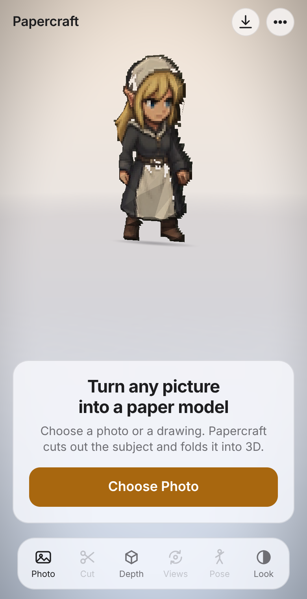

# Papercraft: the motif

The opening page, the UI's type and colours, and the girl turning on the stage are the company's look. Keep them as they are.
`node tools/check_brand.js` guards every rule below (in the generator and the page it writes); to change the motif on purpose,
change this file and that list together.

## The girl on the stage
- **Sudashorn** (the game's `sud/stand` sprite, from Saga of Koto) opens the app, alone on the stage, turning slowly.
- Folded as **Facets** at **PS2 Low** (about 300 triangles), with the middle of the Flat ↔ Sculpted slider: low-poly planes over her own painting.
- She turns at **0.3 radians a second** (Turn slowly is on by default), seen from a little to the side (yaw 0.5) and a little above (pitch 0.22).
- She stands above the welcome card, on a soft shadow, on the calm studio stage (warm light above, cool floor below).

## Type
- The system font stack: `-apple-system, BlinkMacSystemFont, "SF Pro Text", "Helvetica Neue", system-ui, sans-serif` (San Francisco on Apple devices).
- Body 15 px / 1.35. Wordmark **Papercraft**, 17 px semibold, letter-spacing −0.01 em, top left; it is also the Home button (back to the start page from anywhere, over any sheet). Headline 22 px bold, letter-spacing −0.02 em, balanced lines.
- Opening words: **Turn any picture into a paper model** / *Choose a photo or a drawing. Papercraft cuts out the subject and folds it into 3D.* / **Choose Photo**.

## Colour
| | Light | Dark |
|---|---|---|
| Stage | `#ececf1`, floor `#dcdce4` | `#1b1b1f`, floor `#2b2b31` |
| Labels | `#1d1d1f`, secondary `#6e6e73` | `#f5f5f7`, secondary `#98989d` |
| Tint (amber) | `#a8670f` on white ink | `#e0a447` on `#1d1d1f` ink |

The amber tint is the only accent: the primary button, the selected tool, a pressed pill, a joint you hold, the slider fill.

## Shapes and materials
- Frosted glass for everything that floats over the stage (tool bar, panels, round buttons, welcome card): the material colour, saturate 180 % and blur 20 px, a hairline border.
- One floating tool bar at the bottom (radius 22 px): Photo, Cut, Depth, Views, Pose, Look. One panel at a time above it (radius 14 px); the figure is lifted into the space a panel or sheet leaves free.
- Segmented controls in the iOS manner; pills for single actions; the primary button 50 px tall, radius 14 px.
- Apple's restraint: one accent, plain words, nothing on screen that is not needed for the step you are on.
